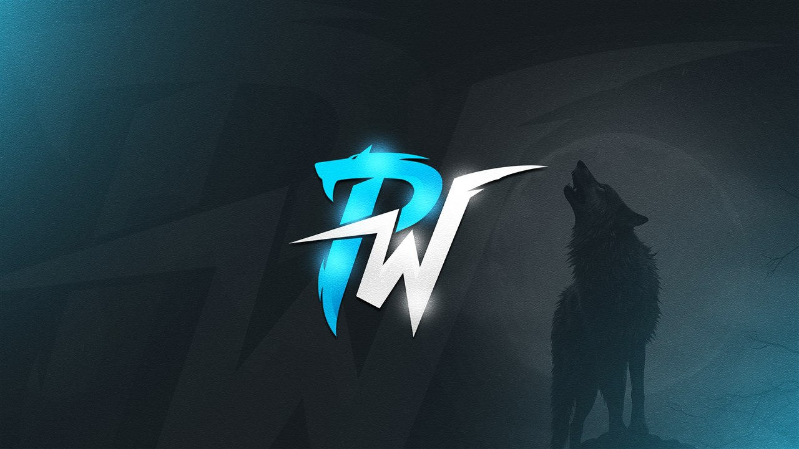

# Polar Account Switcher

Fast desktop app for switching game/platform accounts from one place.



## Download

- Latest release page: <https://github.com/PolarWoIF/PolarAccountsSwitcher/releases/latest>
- Releases list: <https://github.com/PolarWoIF/PolarAccountsSwitcher/releases>

Release assets include:

- `Polar Account Switcher - Installer.exe`
- `PolarWolves.7z`
- `PolarWolves.zip`
- `PolarWolves_and_CEF.7z`

## What This Repo Contains

This repository is intentionally cleaned and kept minimal:

- No old release dumps
- No legacy website upload scripts
- No build output (`bin`, `obj`, archives, installers)
- Source code and build scripts only

## Main Folders

- `PolarWolves-Client` - WPF desktop app (main executable)
- `PolarWolves-Server` - local backend/web UI
- `PolarWolves-Globals` - shared helpers
- `PolarWolves-Tray` - tray process
- `PolarWolves-Updater` - update/diff logic
- `Installer` - first-run installer project
- `_Updater_Wrapper` - wrapper executable project
- `PolarWolves` - MSIX/packager project
- `other/NSIS` - NSIS installer script and installer images

## Requirements

- Windows 10/11
- .NET SDK 9.x
- Visual Studio 2022 (for full solution work)

## Quick Build (Developer)

```powershell
dotnet build .\PolarWolves-Client\PolarWolves-Client.csproj -c Release -p:Platform=x64 -p:SkipPolarPostBuild=true
```

## Full Release Build

The full release packaging pipeline is driven by:

- `PolarWolves-Client/PostBuild.bat`
- `other/NSIS/nsis-build-x64.nsi`

This path creates the installer and release archives.

## Automated Releases

GitHub Actions workflow `.github/workflows/release.yml` can build and publish release assets.

- Trigger by pushing a tag like `v2026.04.07`
- Or run manually from **Actions -> Release Build & Publish**

## Notes

- Repository default branch: `main`
- GitHub Actions CI validates build on Windows
